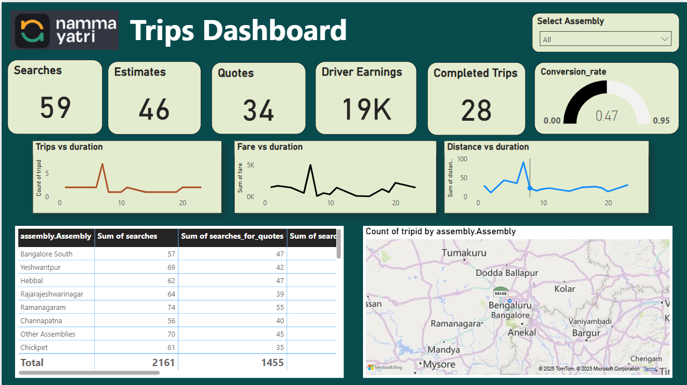

🚕 Namma Yatri Trips Dashboard – Power BI + SQL Analysis

This project presents a comprehensive data analysis and interactive dashboard for Namma Yatri, a ride-hailing app serving the southern region of India. Similar to Ola and Uber, Namma Yatri connects users with local drivers for seamless intra-city travel.

📊 Project Overview
Tools Used: Power BI, SQL, Excel

Data Source: Aggregated ride data (searches, quotes, completed trips, earnings, etc.)

Objective: To analyze trip-related metrics, user engagement, driver performance, and regional distribution of activity.

✅ Features
📈 Interactive Power BI Dashboard
Visualizes key metrics like:

Total Searches, Estimates, Quotes

Driver Earnings & Completed Trips

Conversion Rate Analysis

Trips, Fare & Distance vs Duration Trends

Assembly-wise trip distribution and map integration

💾 SQL Problem Solving
Includes a collection of solved SQL queries that:

Extract key insights from raw data

Prepare aggregated datasets for dashboard visualizations

Perform filtering, grouping, joins, and performance calculations

🧩 Key Insights
Conversion rate of 47% from quotes to completed trips

Bangalore South, Hebbal, and Ramanagaram show high search activity

Clear correlation between trip duration and distance across assemblies
